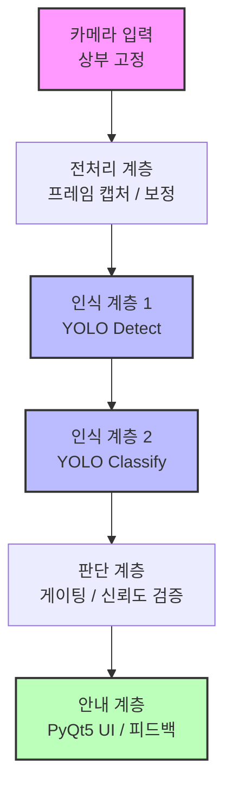

# 🛠️ Realtime Assembly Guide (Vision-based)


> **비전 인식 기반 실시간 조립 가이드 시스템** > 작업 공간을 관찰하는 상부 고정 카메라와 YOLO 기반 AI 모델을 결합하여, 사용자가 종이 설명서 없이도 현재 조립 단계에 맞는 가이드를 실시간으로 제공받을 수 있는 스마트 자동화 솔루션입니다.

## 시연 영상

**Demo Video**: [Watch on YouTube](https://youtu.be/sAVkPxLrHNo)

<div align="center">
  
</div>

## 프로젝트 설명

본 프로젝트는 컴퓨터 비전과 GUI 애플리케이션을 결합한 AI 컨버전스 로봇 소프트웨어 비전 프로젝트입니다.  
사용자는 조립 대상의 현재 상태를 카메라로 보여주기만 하면 되고, 시스템은 다음과 같은 흐름으로 동작합니다.

1. 카메라가 작업 장면을 입력받음
2. Detect 모델이 부품 존재 여부와 위치를 파악함
3. Classify 모델이 현재 조립 단계를 판별함
4. PyQt5 UI가 현재 단계에 맞는 텍스트/이미지 가이드를 자동 표시함
5. 조건이 충족 시 자동으로 다음 단계 이동함

이 프로젝트는 DIY 조립물, 3D 프린팅 조립품, 교육용 키트, 가구 조립 등 다양한 B2C 조립 시나리오로 확장할 수 있습니다.

## 핵심 기능

- 실시간 카메라 기반 조립 상태 인식
- YOLO Detect 기반 부품 검출
- YOLO Classify 기반 조립 단계 판별
- 단계 조건 충족 여부에 따른 자동 가이드 전환
- 부품 체크리스트 표시
- 잘못된 자동 진행을 줄이기 위한 게이팅 로직 적용
- 로컬 환경에서 독립 실행 가능한 구조

## 프로젝트 목표

- 종이 설명서 탐색 부담 감소
- 조립 단계 누락 및 순서 오류 방지
- 초보자도 따라가기 쉬운 실시간 가이드 제공
- 향후 엣지 디바이스 및 서버형 구조로 확장 가능한 기반 마련

## 기술 스택

- **Language**: Python 3.10

- **Vision**: Ultralytics YOLO11n / YOLO11n-cls

- **GUI**: PyQt5

- **Labeling Tool**: labelImg

- **Image Processing**: OpenCV
- **Deep Learning**: PyTorch, Torchvision
- **Environment**: Windows 11

## 시스템 개요


전체 시스템은 독립적이고 유기적인 계층형 아키텍처로 설계되었습니다.



본 시스템은 다음 계층으로 구성됩니다.

입력 계층: 상부 고정 카메라

전처리 계층: 프레임 캡처, 리사이즈, 기본 보정

인식 계층 1: YOLO Detect 모델

인식 계층 2: YOLO Classify 모델

판단 계층: 단계 게이팅, 신뢰도 조건, 체크리스트 로직

안내 계층: PyQt5 기반 UI

콘텐츠 계층: 모델 파일, 단계별 텍스트, 이미지 리소스

## 대표 PoC 대상

본 프로젝트의 대표 PoC는 Foosball 3D 프린팅 조립물입니다.

부품 종류: 14종

총 부품 수: 30개

표준 조립 단계: 8단계

학습용 확장 단계: 17단계

추가로 Raspberry Pi 5 케이스 및 PCB 받침대 가이드에도 확장 적용되었습니다.

## 성능 요약

Foosball 환경 기준 검증 결과:

Detect 모델

mAP@50: 97.85%

mAP@50-95: 84.51%

Classify 모델

Top-1 Accuracy: 95.37%
(3개 모델 평균 기준)

위 수치는 Foosball 중심 데이터셋 및 실험 환경 기준입니다.

## 트러블슈팅 및 성능 최적화 (Troubleshooting)

- **이슈:** 단일 부품 위주로 학습된 초기 모델이 실제 복합 조립 환경(부품이 겹치거나 가려지는 상황)에서 인식률(Confidence Score)이 저하되고 오탐지하는 현상 발생.
- **해결 방안:** 1. 빈 작업 환경을 Default 클래스로 별도 학습하여 오탐지 방지.
  2. 미완성 상태와 완성 상태 이미지를 직접 라벨링 및 전처리하여 데이터셋 고도화.
  3. 프레임 스킵 로직을 적용하여 실시간 추론 시 연산 부하 최소화.
- **결과:** 실제 조립 환경에서의 객체 인식 안정성을 대폭 확보하고, AI 모델의 한계를 데이터 품질 개선으로 극복하였습니다.

## 설치 및 실행 가이드

# 1. Clone the repository
git clone [https://github.com/Tran9523/Realtime_Assembly_Guide.git](https://github.com/Tran9523/Realtime_Assembly_Guide.git)
cd Realtime_Assembly_Guide

# 2. Run the UI Application
cd app
python Realtime_Assembly_Guide.py

# 3-1. If you want to make sample of Detect Models
cd ../train
python prepare_dataset.py
python train_yolo_cls.py

# 3-2. Make sample of Classfiy Models
python train_yolo_all.py

## 프로젝트 구조

```bash
Realtime_Assembly_Guide/
├─ README.md
├─ app/
│  ├─ README.md
│  ├─ Realtime_Assembly_Guide.py
│  ├─ assets/
│  │  ├─ foosball/
│  │  ├─ plates_tool/
│  │  └─ raspberry_pi/
│  ├─ YOLO11_model/
│  │  ├─ detect_all/
│  │  │  └─ weights/
│  │  │  │  └─ best.pt
│  │  └─ classify_foosball/
│  │  │  └─ weights/
│  │  │  │  └─ best.pt
│  │  └─ classify_plates/
│  │  │  └─ weights/
│  │  │  │  └─ best.pt
│  │  └─ classify_raspberry/
│  │  │  └─ weights/
│  │  │  │  └─ best.pt
├─ train/
│  ├─ README.md
│  ├─ dataset_detect_parts/
│  │  ├─ images_all/
│  │  └─ labels_all/
│  ├─ source/
│  │  ├─ step0/
│  │  ├─ step1/
│  │  └─ step1_error/
│  │  └─ ...
│  ├─ prepare_dataset.py
│  ├─ train_yolo_all.py
│  ├─ train_yolo_cls.py
```
